# Architecture Diagram

## System Overview

## Data Flow Architecture

## Component Architecture

```mermaid
flowchart TB
    subgraph Layout["🎨 Layout Components"]
        Header
        Footer
    end

    subgraph AssessmentComponents["📊 Assessment"]
        QuestionCard
        ProgressIndicator
        CategoryLabel
    end

    subgraph ResultsComponents["📈 Results"]
        ScoreGauge
        RadarChart
        DimensionBreakdown
        ComparisonCard
        AICoach["AI Coach Panel"]
    end

    subgraph JournalComponents["📝 Journal"]
        JournalEntryForm
        JournalHistory
        JournalInsights
    end

    subgraph SharedUI["🧩 Shared UI"]
        Icon
        HeroUI["HeroUI Components"]
    end

    Layout --> AssessmentComponents & ResultsComponents & JournalComponents
    AssessmentComponents & ResultsComponents & JournalComponents --> SharedUI
```

## API Architecture

```mermaid
flowchart TB
    subgraph APIRoutes["🔌 API Routes"]
        subgraph AssessmentAPIs["/api/assessment"]
            Q["/questions\nGET: Fetch questions"]
            S["/submit\nPOST: Submit & score"]
        end

        subgraph JournalAPIs["/api/journal"]
            JA["/analyze\nPOST: Analyze entry"]
            JT["/trends\nPOST: Trend analysis"]
        end

        subgraph ResultsAPIs["/api/results"]
            RS["/suggestions\nPOST: AI Coach"]
        end
    end

    subgraph Services["⚙️ Services"]
        GeminiService["gemini.ts"]
    end

    subgraph Functions["📦 Functions"]
        F1[analyzeJournalEntry]
        F2[analyzeTrends]
        F3[generateAISuggestions]
    end

    JA --> GeminiService
    JT --> GeminiService
    RS --> GeminiService
    GeminiService --> F1 & F2 & F3
```

## Assessment Scoring Flow

## Journal NLP Pipeline

## Tech Stack Layers

```mermaid
flowchart TB
    subgraph Presentation["🎨 Presentation Layer"]
        React[React 18]
        TW[TailwindCSS]
        HUI[HeroUI]
        FM[Framer Motion]
    end

    subgraph Application["⚡ Application Layer"]
        Next[Next.js 15\nApp Router]
        TS[TypeScript]
        API[API Routes]
    end

    subgraph Data["💾 Data Layer"]
        LS[localStorage]
        Research[Research CSV\nn=401]
    end

    subgraph External["☁️ External"]
        Gemini[Google Gemini\ngemini-2.0-flash]
        Vercel[Vercel Hosting]
    end

    Presentation --> Application --> Data
    Application <--> External
```

## File Structure

```mermaid
flowchart TB
    subgraph Root["📁 Project Root"]
        App["app/"]
        Components["components/"]
        Lib["lib/"]
        Docs["docs/"]
    end

    subgraph AppDir["app/"]
        AppPages["page.tsx\nlayout.tsx"]
        AppAPI["api/"]
        AppRoutes["assessment/\nresults/\njournal/\ndashboard/"]
    end

    subgraph ComponentsDir["components/"]
        CompAssess["assessment/"]
        CompResults["results/"]
        CompJournal["journal/"]
        CompLayout["layout/"]
        CompUI["ui/"]
    end

    subgraph LibDir["lib/"]
        LibAssess["assessment/\nquestions.ts\nscoring.ts\npredictions.ts"]
        LibJournal["journal/\ntypes.ts"]
        LibServices["services/\ngemini.ts"]
    end

    Root --> App & Components & Lib & Docs
    App --> AppPages & AppAPI & AppRoutes
    Components --> CompAssess & CompResults & CompJournal & CompLayout & CompUI
    Lib --> LibAssess & LibJournal & LibServices
```

---

## Key Design Decisions

| Decision | Rationale |
|----------|-----------|
| **localStorage** | MVP simplicity, no backend needed, instant persistence |
| **Gemini 2.0 Flash** | Fast, cost-effective, structured JSON output |
| **Next.js App Router** | Modern React patterns, API routes, easy Vercel deploy |
| **HeroUI** | Beautiful components, TailwindCSS compatible |
| **Client-side scoring** | Immediate feedback, no server round-trip |
| **Research-based thresholds** | Authentic data from n=401 study |
